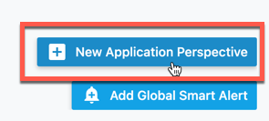
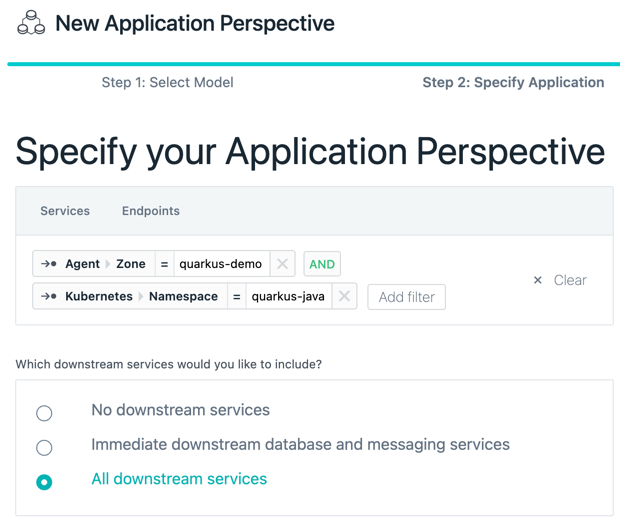
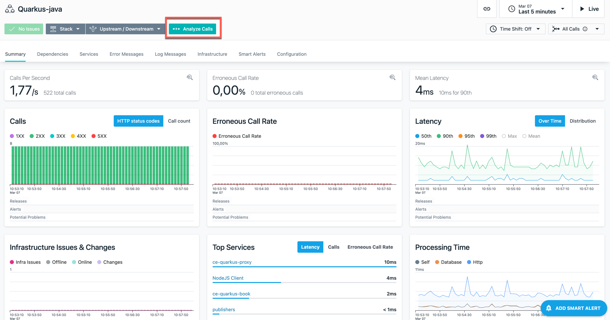
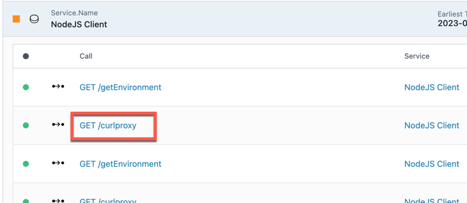
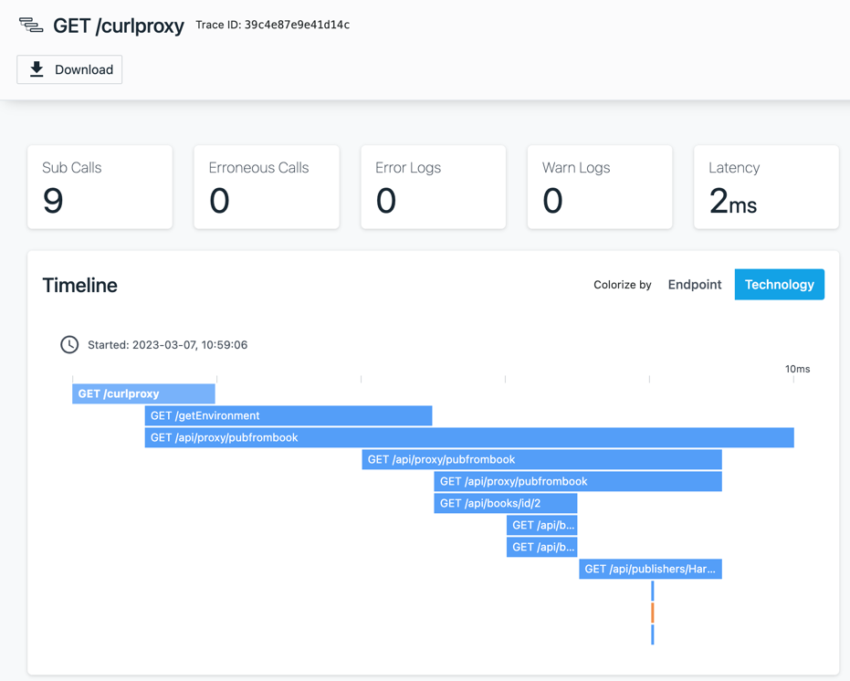

# Instana Setup

## Create an application

The easiest way to observe this application in Instana is to create a new Application perspective. From the Applications page create a new application perspective (button bottom right).

Filter this application to your zone or cluster (in my case the OpenShift cluster was in its own zone) and specify the namespace (aka project) you created above for this application.

Give the application a name and choose "All Calls". Now you need to give it a couple of minutes before you'll see the data flow.

## View your application

Now go to you newly created application perspective. You should see something like this. Click on "Analyze calls"

Then, in the bottom section, click on the "NodeJS client" service

This will show you all requests from the Node.js application. Click on one of the "/curlproxy" calls.

This will show you a page with the entire flow from one call.

