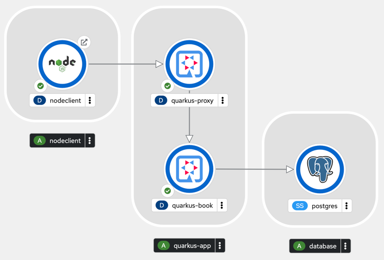

# Quarkus Demo app for Instana monitoring

In order to investigate how a Quarkus app running on OpenShift behaves in the context of Instana observability, a demo application has been built.

The demo consists of two quarkus applications, a postgresql database and a nodejs client application. Below you see how it looks after you deploy it.

The Node.js application will start a continuous loop to call the Quarkus-proxy app every 5 seconds. This Quarkus-proxy app will then do two calls to the Quarkus-book app. One of these two calls will reach out to the postgresql database to get some data.

The Node.js application has been instrumented with the necessary Instana library to provide telemetry data. The Quarkus application has been instrumented with Open Telemetry, but this can be switched on or off. The postgresql database is an out of the box deployment, so you will get some Instana agents errors on it. I will explain later how you can get rid of them.

The Quarkus applications can be deployed as standard jvm based applications or as natively compiled apps. If you run Quarkus as a standard java application, the Instana monitoring is no different than any other java based application running in a JVM. But Quarkus can be compiled to a native binary that can be run standalone. In this case Instana has no out of the box sensor to capture data. That's why the Quarkus applications have been instrumented with Open Telemetry to get some data to Instana via this way.

The above setup allows you to compare the metrics from the default Instana jvm sensor against the Open Telemetry integration. At the time of writing, Open Telemetry support in Instana is still in beta, but it already provides some decent insights.

## Prerequisites

In order to run this demo you will need an OpenShift cluster version 4.10 or 4.12 (currently no guarantee that it will work on another version, but you can always try of course).
To see the results in Instana, you will need to instrument this cluster with the Instana agents and have access to an Instana environment where these agents will report into.

## Installation of the Demo Application

The details on how to install the demo application can be found [here](DEMOAPP-SETUP.MD).

## Installing the Instana Agent

If you need to know how to deploy the Instana Agent on your cluster, check this info.

## Viewing the data in Instana

The details on how to check the data on the Instana side can be found [here](INSTANA-SETUP.MD).

## References

- [Quarkus official website](https://quarkus.io)
